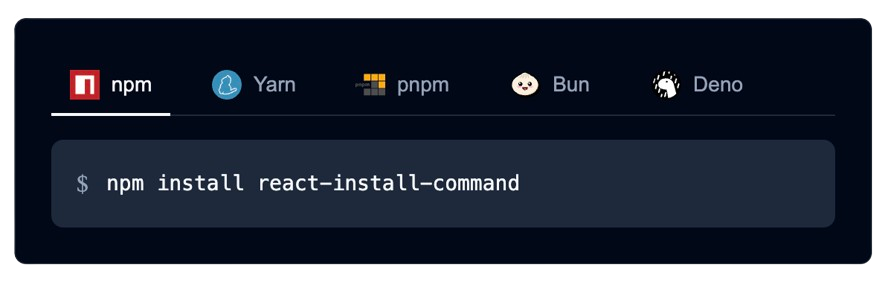

# 📡 React Install Command

A React component for rendering a 'npm install <package name>' code block. Supports multiple package managers and variations of install commands. Totally customizable. Drop it into an MDX file, a Shadcn component, a Tailwind codebase, use our built in styles or even go unstyled. You choose.

Visit the [Storybook](https://timmikeladze.github.io/react-install-command/) for examples and documentation.



## Features

- 🚀 Support for major package managers (npm, Yarn, pnpm, Bun, Deno).
- 🌓 Dark, light and system theme support out of the box.
- 🔄 Interactive tab switching between package managers.
- 📋 One-click copy to clipboard.
- 🎯 Support for various installation options (dev, peer, optional, global).
- 🔧 Highly customizable UI through slots and class names.
- 📦 Support for multiple package registries (npm, JSR).
- 🛠️ Extensible with custom package managers and commands.

## Installation

```bash
npm install react-install-command
```

## Usage

### Basic Usage

```tsx
import { InstallCommand } from 'react-install-command';
import 'react-install-command/styles.css'; // Optional, uses default styles

function App() {
  return (
    <InstallCommand packageName="your-package-name" />
  );
}
```

### Options

```tsx
// Dev dependency
<InstallCommand packageName="typescript" isDev />

// Peer dependency
<InstallCommand packageName="react" isPeer />

// Optional dependency
<InstallCommand packageName="lodash" isOptional />

// Global installation
<InstallCommand packageName="create-react-app" isGlobal />

// Specific version
<InstallCommand packageName="react" version="^18.0.0" />

// Using tag
<InstallCommand packageName="next" tag="canary" />

// Multiple packages
<InstallCommand packageName="react react-dom @types/react" />
```

### Theming

```tsx
// Dark theme
<InstallCommand packageName="your-package" theme="dark" />

// Light theme
<InstallCommand packageName="your-package" theme="light" />

// System theme (default)
<InstallCommand packageName="your-package" theme="system" />
```

### Custom Styling

```tsx
// Using slot class names
<InstallCommand
  packageName="your-package"
  slotClassNames={{
    root: "custom-root-class",
    navigation: "custom-nav-class",
    tab: "custom-tab-class",
    commandContainer: "custom-container-class",
    commandPrefix: "custom-prefix-class",
    commandText: "custom-text-class",
    copyButton: "custom-copy-class"
  }}
/>

// Using custom slots
<InstallCommand
  packageName="your-package"
  slots={{
    commandText: ({ children, className }) => (
      <code className={className}>
        <span style={{ color: "purple" }}>{">"}</span> {children}
      </code>
    ),
    copyButton: ({ onClick }) => (
      <button onClick={onClick} style={{ background: "purple", color: "white" }}>
        Copy Command
      </button>
    )
  }}
/>
```

### Custom Package Managers

```tsx
<InstallCommand
  packageName="your-package"
  managers={[
    {
      id: "custom-pm",
      name: "Custom PM",
      icon: () => <YourCustomIcon />,
      getCommand: (pkg, options) => `custom-pm install ${pkg}`
    }
  ]}
/>
```

### Event Handlers

```tsx
<InstallCommand
  packageName="your-package"
  onCopy={(command, manager) => {
    console.log(`Copied command: ${command} for manager: ${manager.name}`);
  }}
  onTabChange={(managerId, manager) => {
    console.log(`Switched to ${manager.name} (${managerId})`);
  }}
/>
```

## Props

| Prop | Type | Default | Description |
|------|------|---------|-------------|
| packageName | string | "" | The name of the package(s) to generate install commands for |
| isDev | boolean | false | Whether to install as a dev dependency |
| isPeer | boolean | false | Whether to install as a peer dependency |
| isOptional | boolean | false | Whether to install as an optional dependency |
| isGlobal | boolean | false | Whether to install globally |
| useShorthand | boolean | false | Whether to use shorthand commands (e.g. 'npm i' vs 'npm install') |
| version | string | undefined | Version range for the package |
| tag | string | undefined | Tag for the package |
| registry | "npm" \| "jsr" | undefined | Package registry to use (for Deno packages) |
| theme | "light" \| "dark" \| "system" | "system" | The color theme to use |
| managers | Manager[] | defaultManagers | Array of package managers to display |
| customCommands | Record<string, string> | undefined | Custom commands to override the defaults |
| slots | Slots | {} | Custom slot components for rendering |
| slotClassNames | SlotClassNames | {} | Custom classNames for each slot |
| commandPrefix | string | "$" | Custom prefix symbol to show before the command |
| copyIcon | () => JSX.Element | defaultCopyIcon | Custom copy icon component |
| onCopy | (command: string, manager: Manager) => void | undefined | Callback fired when command is copied |
| onTabChange | (managerId: string, manager: Manager) => void | undefined | Callback fired when selected manager changes |

## Types

### Manager

```typescript
interface Manager {
  id: string;
  name: string;
  icon: () => JSX.Element;
  getCommand: (
    packageName: string,
    options: {
      isDev?: boolean;
      isPeer?: boolean;
      isOptional?: boolean;
      isGlobal?: boolean;
      useShorthand?: boolean;
      version?: string;
      tag?: string;
      registry?: "npm" | "jsr";
    }
  ) => string;
}
```

### Slots

```typescript
interface Slots {
  root?: (props: SlotProps) => ReactNode;
  navigation?: (props: SlotProps) => ReactNode;
  tab?: (props: TabSlotProps) => ReactNode;
  commandContainer?: (props: SlotProps) => ReactNode;
  commandPrefix?: (props: SlotProps) => ReactNode;
  commandText?: (props: SlotProps) => ReactNode;
  copyButton?: (props: CopyButtonSlotProps) => ReactNode;
}
```
