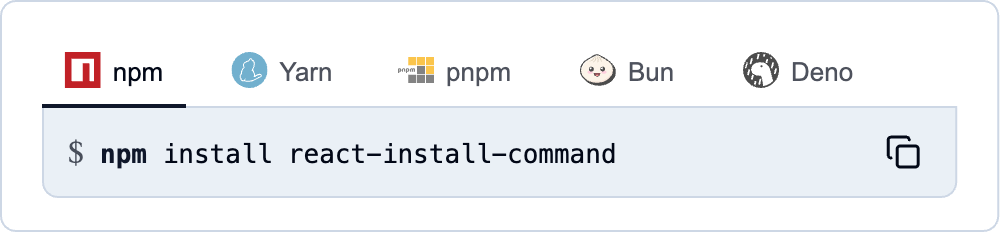
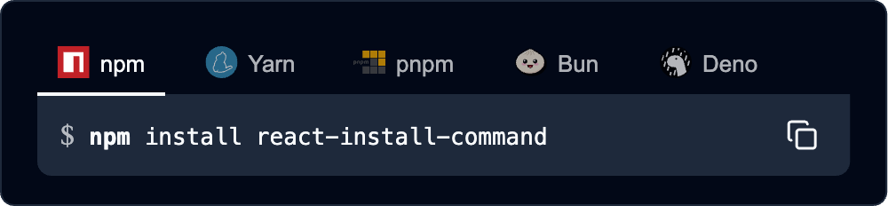

# 📡 React Install Command

A React component for rendering a 'npm install package-name' code block. Supports multiple package managers and variations of install commands. Totally customizable. Drop it into an MDX file, a Shadcn component, a Tailwind codebase, use built-in styles or even go unstyled. You choose.

Visit the [Storybook](https://react-install-command.vercel.app/) for examples and documentation.





## Features

- 🚀 Support for major package managers (npm, Yarn, pnpm, Bun, Deno).
- 🌓 Dark, light and system theme support out of the box.
- 🔄 Interactive tab switching between package managers.
- 📋 One-click copy to clipboard.
- 🎯 Support for various installation options (dev, peer, optional, global).
- 🔧 Highly customizable UI through slots and class names.
- 📦 Support for multiple package registries (npm, JSR).
- 🛠️ Extensible with custom package managers and commands.

## Installation

```bash
npm install react-install-command
```

> 👋 Hello there! Follow me [@linesofcode](https://twitter.com/linesofcode) or visit [linesofcode.dev](https://linesofcode.dev) for more cool projects like this one.

## Usage

### Basic Usage

```tsx
import 'react-install-command/styles.css';

import { InstallCommand } from 'react-install-command';


// Basic usage
<InstallCommand packageName="your-package" />

// Dev dependency
<InstallCommand packageName="typescript" isDev />

// Peer dependency
<InstallCommand packageName="react" isPeer />

// Optional dependency
<InstallCommand packageName="lodash" isOptional />

// Global installation
<InstallCommand packageName="create-react-app" isGlobal />

// Specific version
<InstallCommand packageName="react" version="^18.0.0" />

// Using tag
<InstallCommand packageName="next" tag="canary" />

// Multiple packages
<InstallCommand packageName="react react-dom @types/react" />

// Using shorthand commands (e.g., 'npm i' instead of 'npm install')
<InstallCommand packageName="lodash" useShorthand />
```

### Registry Support

```tsx
// Using JSR registry (automatically selects Deno)
<InstallCommand 
  packageName="@std/path" 
  registry="jsr" 
/>

// Installing npm package with Deno
<InstallCommand 
  packageName="react" 
  registry="npm"
  managers={[defaultManagers[4]]} // Only Deno manager
/>

// Mixed registry packages
<InstallCommand 
  packageName="jsr:@std/path jsr:@std/assert npm:chalk" 
/>
```

### Theming

```tsx
// Dark theme
<InstallCommand packageName="your-package" theme="dark" />

// Light theme
<InstallCommand packageName="your-package" theme="light" />

// System theme (default)
<InstallCommand packageName="your-package" theme="system" />

// Custom styling with CSS variables
<div style={{
  '--primary': 'purple',
  '--accent': 'lavender',
  '--radius': '0'
}}>
  <InstallCommand packageName="your-package" />
</div>
```

### Custom Package Managers

```tsx
<InstallCommand
  packageName="your-package"
  managers={[
    {
      id: "npm",
      name: "npm",
      icon: () => (
        <Icon
          icon="logos:npm-icon"
          width={24}
          height={24}
          aria-label="npm package manager"
        />
      ),
      getCommand: (pkg, options) => {
        const { isDev, useShorthand } = options;
        return `npm ${isDev ? (useShorthand ? "i -D" : "install -D") : useShorthand ? "i" : "install"} ${pkg}`;
      }
    }
  ]}
/>

// Reordering default managers
<InstallCommand
  packageName="react"
  managers={[
    defaultManagers[2], // pnpm first
    defaultManagers[0], // npm second
    defaultManagers[1], // yarn third
  ]}
/>
```

### Custom Commands

```tsx
<InstallCommand
  customCommands={{
    npm: "npm create vite@latest my-app",
    yarn: "yarn create vite my-app",
    pnpm: "pnpm create vite my-app"
  }}
/>
```

### Customization

```tsx
// Custom class names
<InstallCommand
  packageName="your-package"
  slotClassNames={{
    root: "custom-root",
    navigation: "custom-nav",
    tab: "custom-tab",
    tabIndicator: "install-block-tab-indicator-centered", // Centered indicator
    commandContainer: "custom-container",
    commandPrefix: "custom-prefix",
    commandText: "custom-text",
    copyButton: "custom-copy",
    tabIcon: "custom-tab-icon",
    tabText: "custom-tab-text",
    commandGroup: "custom-group",
    commandTextCommand: "custom-command",
    copyButtonIcon: "custom-copy-icon"
  }}
/>

// Full customization with CSS classes
<InstallCommand
  packageName="your-package"
  slotClassNames={{
    root: "border-2 border-purple-500 rounded-lg",
    navigation: "bg-gray-100 p-2",
    tab: "bg-transparent hover:bg-purple-50 text-black data-[state=active]:bg-purple-500 data-[state=active]:text-white px-2 py-1 mx-1 rounded",
    tabIndicator: "install-block-tab-indicator-gradient", // Gradient indicator
    commandContainer: "p-4 bg-gray-50",
    commandPrefix: "text-purple-500",
    commandText: "text-purple-500 font-mono",
    copyButton: "bg-purple-500 text-white px-2 py-1 rounded border-0"
  }}
/>
```

### Built-in Indicator Variants

The component comes with several built-in indicator variants that you can use:

1. Default indicator (full width):
```tsx
<InstallCommand packageName="your-package" />
```

2. Centered indicator:
```tsx
<InstallCommand
  packageName="your-package"
  slotClassNames={{
    tabIndicator: "install-block-tab-indicator-centered"
  }}
/>
```

3. Gradient indicator:
```tsx
<InstallCommand
  packageName="your-package"
  slotClassNames={{
    tabIndicator: "install-block-tab-indicator-gradient"
  }}
/>
```

You can also create your own indicator styles by extending these classes or creating new ones in your CSS:

```css
.my-custom-indicator {
  left: 15%;
  width: 70%;
  height: 3px;
  border-radius: 1.5px;
  background: linear-gradient(90deg, var(--primary), var(--accent));
  box-shadow: 0 1px 2px rgba(0, 0, 0, 0.1);
}
```

Then use it in your component:
```tsx
<InstallCommand
  packageName="your-package"
  slotClassNames={{
    tabIndicator: "my-custom-indicator"
  }}
/>
```

### Storage Persistence

```tsx
// Persist in localStorage (survives browser restarts)
<InstallCommand 
  packageName="your-package" 
  storageType="local" 
/>

// Persist in sessionStorage (cleared when browser closes)
<InstallCommand 
  packageName="your-package" 
  storageType="session" 
/>

// Custom storage key
<InstallCommand 
  packageName="your-package" 
  storageType="local"
  storageKey="my-custom-storage-key" 
/>
```

### Event Handlers

```tsx
<InstallCommand
  packageName="your-package"
  onCopy={(command, manager) => {
    console.log(`Copied command: ${command} for manager: ${manager.name}`);
    alert("Command copied to clipboard!");
  }}
  onTabChange={(managerId, manager) => {
    console.log(`Switched to ${manager.name} (${managerId})`);
  }}
/>
```

### Combined Features

```tsx
<InstallCommand
  packageName="your-package"
  isDev={true}
  version="^1.0.0"
  useShorthand={true}
  theme="dark"
  commandPrefix="→"
  copyIcon={() => (
    <Icon
      icon="lucide:clipboard-copy"
      width={24}
      height={24}
      aria-label="Copy to clipboard"
    />
  )}
  slotClassNames={{
    root: "custom-root",
    commandText: "custom-text"
  }}
  onCopy={(command) => console.log(`Copied: ${command}`)}
  storageType="local"
/>
```

## Props

| Prop | Type | Default | Description |
|------|------|---------|-------------|
| packageName | string | "" | The name of the package(s) to generate install commands for |
| isDev | boolean | false | Whether to install as a dev dependency |
| isPeer | boolean | false | Whether to install as a peer dependency |
| isOptional | boolean | false | Whether to install as an optional dependency |
| isGlobal | boolean | false | Whether to install globally |
| useShorthand | boolean | false | Whether to use shorthand commands (e.g. 'npm i' vs 'npm install') |
| version | string | undefined | Version range for the package |
| tag | string | undefined | Tag for the package |
| registry | "npm" \| "jsr" | undefined | Package registry to use (for Deno packages) |
| theme | "light" \| "dark" \| "system" | "system" | The color theme to use |
| managers | Manager[] | defaultManagers | Array of package managers to display |
| customCommands | Record<string, string> | undefined | Custom commands to override the defaults |
| slots | Slots | {} | Custom slot components for rendering |
| slotClassNames | SlotClassNames | {} | Custom classNames for each slot |
| commandPrefix | string | "$" | Custom prefix symbol to show before the command |
| copyIcon | () => JSX.Element | defaultCopyIcon | Custom copy icon component |
| onCopy | (command: string, manager: Manager) => void | undefined | Callback fired when command is copied |
| onTabChange | (managerId: string, manager: Manager) => void | undefined | Callback fired when selected manager changes |
| storageType | "local" \| "session" \| "none" | "none" | Storage type for persisting package manager selection |
| storageKey | string | "preferred-package-manager" | Storage key for persisting package manager selection |

## Types

### Manager

```typescript
interface Manager {
  id: string;
  name: string;
  icon: () => JSX.Element;
  getCommand: (
    packageName: string,
    options: {
      isDev?: boolean;
      isPeer?: boolean;
      isOptional?: boolean;
      isGlobal?: boolean;
      useShorthand?: boolean;
      version?: string;
      tag?: string;
      registry?: "npm" | "jsr";
    }
  ) => string;
}
```

### Slots

```typescript
interface Slots {
  root?: (props: SlotProps) => ReactNode;
  navigation?: (props: SlotProps) => ReactNode;
  tab?: (props: TabSlotProps) => ReactNode;
  commandContainer?: (props: SlotProps) => ReactNode;
  commandPrefix?: (props: SlotProps) => ReactNode;
  commandText?: (props: SlotProps) => ReactNode;
  copyButton?: (props: CopyButtonSlotProps) => ReactNode;
}
```

## CSS Variables

The component uses CSS variables for theming. You can override these variables to customize the appearance:

```css
:root {
  /* Base colors */
  --background: hsl(0 0% 100%);        /* Background color of the component */
  --foreground: hsl(222.2 84% 4.9%);   /* Primary text color */

  /* Muted variants */
  --muted: hsl(210 40% 94%);           /* Background for command area */
  --muted-foreground: hsl(215.4 16.3% 36.9%); /* Secondary text color */

  /* Border colors */
  --border: hsl(214.3 31.8% 85%);      /* Border color for containers */

  /* Primary colors */
  --primary: hsl(222.2 47.4% 11.2%);   /* Color for active elements */
  --primary-foreground: hsl(210 40% 98%); /* Text on primary color */

  /* Accent colors */
  --accent: hsl(210 40% 90%);          /* Background for hover states */
  --accent-foreground: hsl(222.2 47.4% 11.2%); /* Text on accent color */

  /* Border radius */
  --radius: 0.5rem;                    /* Border radius for containers */
}
```

### Usage Examples

1. Override all variables:
```css
:root {
  --background: white;
  --foreground: black;
  --muted: #f5f5f5;
  --border: #e5e5e5;
  --primary: blue;
  --accent: #eef;
  --radius: 8px;
}
```

2. Override specific variables:
```css
.my-theme {
  --primary: purple;
  --accent: lavender;
}
```

3. Dark theme override:
```css
[data-theme="dark"] {
  --background: hsl(222.2 84% 4.9%);
  --foreground: hsl(210 40% 98%);
  --muted: hsl(217.2 32.6% 17.5%);
  --border: hsl(217.2 32.6% 17.5%);
}
```

4. Scoped customization:
```css
.custom-install-command {
  --radius: 0;                /* Remove border radius */
  --border: transparent;      /* Remove borders */
  --muted: transparent;       /* Remove background */
}
```

### Available Variables

| Variable | Purpose | Default (Light) | Default (Dark) |
|----------|---------|----------------|----------------|
| --background | Component background | `hsl(0 0% 100%)` | `hsl(222.2 84% 4.9%)` |
| --foreground | Primary text color | `hsl(222.2 84% 4.9%)` | `hsl(210 40% 98%)` |
| --muted | Command area background | `hsl(210 40% 94%)` | `hsl(217.2 32.6% 17.5%)` |
| --muted-foreground | Secondary text | `hsl(215.4 16.3% 36.9%)` | `hsl(215 20.2% 65.1%)` |
| --border | Border color | `hsl(214.3 31.8% 85%)` | `hsl(217.2 32.6% 17.5%)` |
| --primary | Active/accent elements | `hsl(222.2 47.4% 11.2%)` | `hsl(210 40% 98%)` |
| --primary-foreground | Text on primary | `hsl(210 40% 98%)` | `hsl(222.2 47.4% 11.2%)` |
| --accent | Hover state background | `hsl(210 40% 90%)` | `hsl(217.2 32.6% 17.5%)` |
| --accent-foreground | Text on accent | `hsl(222.2 47.4% 11.2%)` | `hsl(210 40% 98%)` |
| --radius | Border radius | `0.5rem` | `0.5rem` |

### CSS Classes

The component uses the following CSS classes that you can target for customization:

- `.install-block` - Root container
- `.install-block-nav` - Navigation/tabs container
- `.install-block-tab` - Individual tab buttons
- `.install-block-content` - Command container
- `.install-block-group` - Command text group
- `.install-block-prefix` - Command prefix ($)
- `.install-block-text` - Command text
- `.install-block-text-command` - Command keyword
- `.install-block-copy` - Copy button
